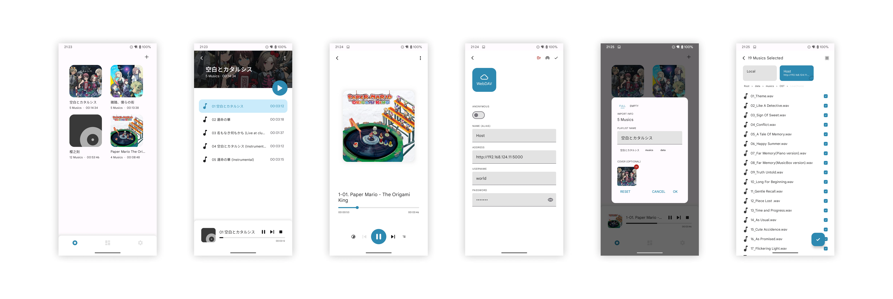

# Ease Music Player

Ease Music Player is a lightweight music player, written in Rust and Jetpack Compose.

Features
----

- WebDAV and OneDrive support
- Playlist-based, music cover and lyric support

ScreenShot
----

Roadmap
----

- v0.4: Plugin support
- v0.5: Ubuntu Linux support
- v0.6: UI/UX Improvements

Motivation
----

The primary purpose of this application is to explore application development with Rust. For more details, please see [motivation](./docs/motivation.md) document.

License
----

- The majority of this project is licensed under the GPL-3.0 license.
- The [ease-order-key](./rust-libs/ease-order-key) is under either the Apache-2.0 or the MIT license.
