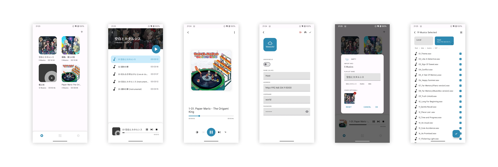

# Ease Music Player

Ease Music Player is a lightweight music player, written in Rust and Jetpack Compose. 

Features
----

- WebDAV and OneDrive support  
- Playlist-based, music cover and lyric support  

ScreenShot
----

FAQ
----

### Why was this application developed?

The primary purpose of this application is to experiment with the feasibility and paradigm of writing core logic in Rust and using other languages (such as Android Kotlin in Android) to write the UI layer.

### Why did the switch from Flutter to Jetpack Compose occur?

[In version 0.1](https://github.com/hpp2334/ease-music-player/tree/feat/flutter), the application was implemented using Rust + Flutter. After some time of use, several issues were discovered, such as:

- Flutter's complexity in cross-platform development, especially when dealing with platform-specific features.

- Difficulty in finding solutions for some minor issues, such as the absence of system-provided crash dialogs when the program crashes.

- Redundancy in "cross-platform" capabilities when compared to Rust.

- ...

Due to the reasons above, the current version uses Jetpack Compose to better integrate with the Android platform.

License
----

GPL v3
